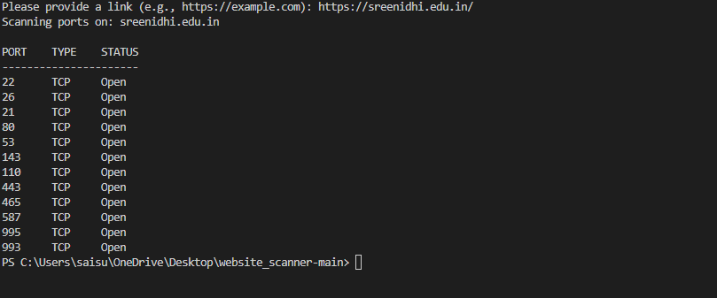

# Web Scanner Project

This project is a terminal-based port scanner that checks for open TCP and UDP ports on a given host. It uses multithreading to speed up the scanning process.

## Screenshot



## How to Clone the Project

To clone this repository and run the project, follow these steps:

1. **Clone the Repository**:
   ```bash
   git clone https://github.com/saisuhas12/web_scan

2. **Navigate to the Project Directory & Run**:
  ```bash
   cd web_scan
   python web_sc.py


